# Doorman

## Project summary

**Doorman** is a privacy-first AI concierge for the front door. It manages doorstep interactions—not just a camera feed—by greeting visitors, identifying their practical intent, handling routine workflows, and involving the homeowner only when needed.

This is an individual project for the Google / Devpost **All Things Agentic Hackathon**. It is not NVIDIA work and must not use NVIDIA confidential information, internal systems, company-owned assets, or imply NVIDIA or Google endorsement.

**Submission deadline:** August 31, 2026, 5:00 PM Pacific.

### Contest-fit boundaries

- The pre-existing Pi, camera, Jetson, and Frigate setup must be disclosed as pre-existing work.
- The contest work is the Doorman application, agentic workflow, Google Cloud integration, cloud state, orchestration, and demo.
- The project must use Gemini 3.5 or newer, a Google agent framework (prefer one: Google ADK or GenKit), and a Google Cloud service.
- Submission needs a reproducible repository and README, architecture diagram, code link, English demo video no longer than four minutes, and evidence of Google Cloud deployment.
- The deployed workflow uses Gemini 3.7 Flash through Google ADK. Real-time visitor voice uses Gemini 3.1 Flash Live Preview through the Gemini Developer API.

## Current state

- The Jetson Orin Nano at the current LAN address `10.0.0.96` runs healthy Frigate and Mosquitto containers plus the Doorman edge bridge.
- Real Frigate person events are normalized by the edge bridge and successfully reach the `doorman.events` Pub/Sub topic.
- The Cloud Run workflow uses Firestore state, Pub/Sub commands, Google ADK, and `gemini-3.7-flash`.
- The private `doorman-live-token-broker` Cloud Run service reads the permanent Gemini key from Secret Manager and returns only short-lived, single-use credentials to the authenticated Jetson edge identity.
- The Raspberry Pi Zero 2 W at the current LAN address `10.0.0.243` uses a Blue Yeti Nano for 16 kHz microphone capture and a paired JBL Flip 5 for PipeWire Bluetooth output.
- Cached clips were generated with `gemini-3.1-flash-tts-preview` using the male `Achird` voice. The greeting is locally cached and guarded by a 60-second cooldown.
- Live visitor conversation uses `gemini-3.1-flash-live-preview`; Pi-to-Jetson and Jetson-to-Pi audio stays on local MQTT, while the Jetson maintains the bounded Gemini Live connection.
- An end-to-end interaction was verified on August 28, 2026: a person entered the frame, heard the cached disclosure, said they were dropping off a package, and received an appropriate spoken Gemini response through the JBL speaker.
- The PWA build emits a manifest and shell-only generated service worker. Case/audio/media data is not intentionally cached, but install icons and a custom install/update prompt are not yet present and browser installation has not been release-verified.
- The repository builds successfully with Node 24, `@google/adk@2.0.0`, `@google/genai@2.19.0`, and `google-auth-library@11.0.2`.
- Google ADK for TypeScript is pinned to the npm `latest` release verified on August 25, 2026: `@google/adk@2.0.0`.
- This document is the single source of truth for the Doorman project.

## Architecture

```mermaid
flowchart LR
  classDef local fill:#e8f2ff,stroke:#2563eb,color:#0f172a
  classDef cloud fill:#eefce8,stroke:#16a34a,color:#0f172a
  classDef external fill:#fff4df,stroke:#d97706,color:#0f172a
  classDef boundary fill:#f8fafc,stroke:#64748b,stroke-dasharray: 5 5,color:#0f172a

  Visitor([Visitor]):::external

  subgraph Home[Home network — continuous video stays local]
    direction LR
    subgraph Pi["Raspberry Pi Zero 2 W — Doorstep I/O"]
      direction TB
      Camera["Camera Module 3\nCSI video capture"]:::local
      Mic["Blue Yeti Nano\nUSB-OTG microphone"]:::local
      Speaker["Bluetooth or wired speaker\nlocal cached greetings + thanks"]:::local
      PiEdge["Doorman Pi edge service\ninteraction timer · audio I/O · privacy minimization"]:::local
      Camera --> PiEdge
      Mic --> PiEdge
      PiEdge --> Speaker
    end

    subgraph Jetson["Jetson Orin Nano — Local perception + voice gateway"]
      direction TB
      Stream["Camera stream receiver"]:::local
      Frigate["Frigate\nlocal object detection\noptional local face-recognition signal"]:::local
      EventBridge["Frigate event bridge\nnormalizes events"]:::local
      VoiceGateway["Doorman voice gateway\nevent-scoped audio relay"]:::local
      Stream --> Frigate --> EventBridge
    end

    Camera -->|"local video stream"| Stream
    EventBridge -->|"person / package / zone event"| PiEdge
    PiEdge -->|"event-scoped audio only"| VoiceGateway
    VoiceGateway -->|"response audio"| PiEdge
  end

  subgraph GoogleCloud["Google Cloud project: doorman-hack-2026"]
    direction TB
    PubSub["Cloud Pub/Sub\ndoorman.events · doorman.commands"]:::cloud
    Run["Cloud Run\nDoorman workflow agent + API + console"]:::cloud
    Firestore["Cloud Firestore\npolicy · case state · audit timeline"]:::cloud
    AgentPlatform["Gemini Enterprise Agent Platform\nGemini workflow model"]:::cloud
    Live["Gemini Live API\nbounded visitor conversation"]:::cloud
    Secrets["Secret Manager\ncredentials + edge secret"]:::cloud
    Logging["Cloud Logging\nobservability"]:::cloud
    PubSub --> Run
    Run <--> Firestore
    Run <--> AgentPlatform
    Run --> Logging
    Secrets -. "runtime access" .-> Run
  end

  PiEdge -->|"privacy-minimized metadata"| PubSub
  EventBridge -. "single policy-approved frame\ndirect HTTPS; never Pub/Sub" .-> Run
  PubSub -->|"safe edge command\nplay clip · open interaction window"| PiEdge
  VoiceGateway <-->|"only while interaction is active"| Live
  Live -->|"typed, untrusted intent only"| Run

  Visitor -->|"approaches / speaks"| Camera
  Visitor -->|"speaks"| Mic
  Speaker -->|"AI disclosure + response"| Visitor

  subgraph Guardrails["Trust boundary"]
    direction TB
    Untrusted["Visitor speech is untrusted\nintent schema only; no privileged tools"]:::boundary
    LocalOnly["Biometric signals stay local\nnever grant access or disclose identity"]:::boundary
  end

  Live -.-> Untrusted
  Frigate -.-> LocalOnly
```



## Hardware and local responsibilities

| Component | Confirmed role |
|---|---|
| Raspberry Pi Zero 2 W | Camera-facing audio I/O, local cached playback, interaction timers, privacy minimization, and edge command handling. It does not run the primary speech/reasoning model. |
| Pi Camera Module 3 | CSI camera connected to the Pi; provides the already-working local video stream. |
| Jetson Orin Nano | Runs/receives Frigate video perception, normalizes Frigate events, and hosts the local voice gateway. |
| Frigate | Local sensor system: object detection and optional local face-recognition signal. Doorman is a separate application layer, not a Frigate frontend modification. |
| Blue Yeti Nano A00098 | USB microphone via the Pi's OTG/data port; USB bus powered. Its 3.5 mm headphone output can provide low-latency wired playback. |
| Bluetooth speaker | Simple proof-of-concept speaker output; usable, but a wired speaker through the Yeti headphone jack is preferred for lower latency and less Wi-Fi/Bluetooth contention. |
| Krisdonia NJF-5X power bank | Powers the Pi via a USB-A output to the Pi's `PWR IN` port. Do not use its adjustable DC output. |
| Micro-USB OTG host adapter | Connects the Yeti's USB cable to the Pi's `USB` data port. No USB hub is required for this topology. |

### Physical topology

```text
Power bank USB-A ── USB power cable ──> Pi Zero 2 W PWR IN
Camera Module 3 ── CSI ribbon ────────> Pi CSI connector
Blue Yeti Nano ── USB cable ──────────> OTG adapter ──> Pi USB data port
Pi Bluetooth (or Yeti headphone jack) ─> speaker
Pi local video stream ────────────────> Jetson Orin Nano / Frigate
```

### Audio verification after the adapter arrives

```bash
lsusb
arecord -l
aplay -l
arecord -D plughw:CARD=<detected-card>,DEV=0 -f S16_LE -r 16000 -c 1 -d 5 /tmp/yeti-test.wav
```

Use the card name reported by `arecord -l`. Test wired playback first if available, then pair and test the Bluetooth speaker. On modern Raspberry Pi OS, use `wpctl status` to inspect PipeWire Bluetooth routing.

## Privacy, safety, and trust boundaries

### Privacy defaults

- Continuous video remains local.
- Cloud events contain structured metadata: event type, timestamp, local event ID, object class, zone, confidence, package state, and interaction state.
- When visual context improves an active interaction, the Jetson may select one event-scoped frame, resize it, strip metadata, and blur the face locally by default before sending it directly to the authenticated Cloud Run workflow.
- Visual frames never travel through Pub/Sub or Firestore. Doorman does not persist the transmitted frame; the durable record contains only non-identifying observations, the action taken, and whether media was shared.
- An unredacted demo mode may be used only for staged interactions with consenting participants. Doorman never sends Frigate face embeddings or identity labels to Gemini and never asks Gemini to identify a visitor.
- Do not claim infrastructure-wide zero retention until the applicable Gemini service caching and abuse-monitoring settings have been configured and verified. The project claim is that frames are not persisted by Doorman.
- The microphone is event-scoped, visibly/audibly disclosed, and closed when an interaction ends or times out. It is not an always-on cloud microphone.

### Hard safety boundaries

Doorman must never autonomously unlock doors, open garages, disable alarms, grant physical access, reveal whether someone is home, disclose schedules/security details, call law enforcement based only on classification, or make consequential decisions based on face recognition.

Local face recognition is an optional weak household-context signal only. It is not visitor identity verification, is never disclosed to the visitor, is not sent to the cloud by default, and cannot authorize access.

### Visitor input and prompt injection

Visitor speech is untrusted. The real-time conversation layer has no privileged tools and produces only a typed result, for example:

```json
{
  "intent": "delivery",
  "message": "Package for Alex",
  "resident_requested": false,
  "signature_required": false,
  "confidence": 0.93
}
```

Only this constrained result reaches the higher-privilege workflow agent. Visitor input cannot change policy, prompts, stored security configuration, permissions, or approval requirements.

## Interaction behavior

### Homeowner console

Doorman has one responsive browser-accessible console from the first deploy, even if its initial interface is minimal. It is an observability and policy surface—not the host of the autonomous interaction. The edge and cloud workflow continue functioning when the console is closed. The console is served by the same Cloud Run application as the workflow API and uses stable API routes so the interface can be redesigned later without replacing the backend.

The application uses one TypeScript stack: React and Vite for the interface, Google ADK for TypeScript for the workflow agent, and a Node server for the Cloud Run API. Three.js and React Three Fiber are installed for an optional playful spatial Doorman interface but are not required for the first operational dashboard. The web app becomes a lightweight PWA through a manifest and shell-only service worker; visitor images, audio, transcripts, and case data are never placed in the offline cache.

The console exposes:

- **Live:** current doorstep interaction and immediate homeowner actions.
- **Activity:** one cross-layer timeline per case, from Frigate detection through edge execution.
- **Packages:** pending, collected, acknowledged, and unresolved deliveries.
- **Devices:** Pi, Jetson, Frigate, microphone, speaker, cloud connection, and last heartbeat.
- **Policies:** editable autonomous responses, notification rules, privacy settings, and retention.

Each timeline records the `case_id`, `trace_id`, timestamp, layer, event type, decision summary, policy applied, tool or edge command, execution result, and whether media was shared. The console shows evidence and decision summaries, not private model chain-of-thought.

The initial UI must use semantic HTML, keyboard-accessible controls, visible focus states, readable contrast, and status text that does not depend on color alone. While private data is present, the deployed console remains authenticated. A public judge-facing version, if added, uses synthetic or sanitized cases only.

### Standard visitor conversation

1. Frigate detects a person in the doorstep interaction zone.
2. Doorman starts an interaction state and plays a local disclosure:

   > “Hi — this is the home’s AI assistant. I can take a message, let the resident know you’re here, or help with a delivery.”

3. The microphone opens for a bounded interaction window.
4. Gemini Live handles the short visitor conversation; the workflow agent receives only the typed intent.
5. Doorman records the resulting case, issues an allowed notification or edge command, and closes the session after completion or timeout.

### Thank-a-driver behavior

When Doorman determines with sufficient confidence that a delivery drop-off is occurring, the Pi immediately plays one pre-cached thank-you clip, such as “Thanks so much—have a great day!” This happens automatically because the driver may leave before a homeowner can respond. The cloud agent logs the acknowledgement and continues the package workflow asynchronously. A manual **Thank driver** action remains available in the console.

The action is idempotent: only one thank-you may play per delivery case within the configured deduplication window. Do not put cloud audio generation in this critical playback path or make unmeasured latency claims.

### Solicitor behavior

When the conversation layer classifies an interaction as a solicitor with sufficient confidence, Doorman handles it without notifying the homeowner. It politely declines—for example, “Thanks for stopping by, but the household is not interested. Have a good day.”—logs the result, and closes the case.

Doorman escalates only when the intent is uncertain, the visitor explicitly requests the homeowner for a non-solicitation reason, the person persists beyond the configured interaction window, or another safety-neutral policy condition requires attention. It never reveals whether the homeowner is present.

### Editable autonomous policies

Automatic responses are Firestore-backed policies, not hard-coded model behavior. Initial policies include:

```json
{
  "delivery_dropoff": {
    "enabled": true,
    "minimum_confidence": 0.85,
    "action": "play_cached_clip",
    "clip": "thanks-driver-v1",
    "notify": "summary",
    "dedupe_seconds": 120
  },
  "solicitor": {
    "enabled": true,
    "minimum_confidence": 0.85,
    "action": "politely_decline",
    "script": "solicitor-decline-v1",
    "notify": "never_unless_escalated",
    "maximum_interaction_seconds": 45
  },
  "halloween": {
    "enabled": false,
    "activation": "manual_or_schedule",
    "local_date": "10-31",
    "local_start": "17:00",
    "local_end": "22:00",
    "action": "friendly_costume_comment",
    "visual_input": "single_minimized_frame",
    "media_retention": "delete_after_inference",
    "fallback": "Happy Halloween!"
  }
}
```

Only the homeowner console or a trusted administrative process can modify policies. Visitor speech cannot change them.

### Seasonal and occasion modes

Doorman supports temporary policy overlays for occasions such as Halloween, holiday deliveries, parties, or an expected neighborhood event. An occasion mode is inactive by default and can be enabled manually or during a homeowner-approved local schedule. It may change the greeting, allowed visual context, conversation style, notification rules, and follow-up behavior without changing the permanent household policy.

Halloween mode may examine one privacy-minimized frame and make a brief, positive comment about visible costume elements such as colors, clothing, props, or a fictional theme. It must not identify the visitor, use face recognition, infer age, gender, ethnicity, disability, or other sensitive traits, evaluate attractiveness, or make comments about the person's body. If the costume is uncertain, Doorman uses a generic greeting instead of guessing.

Because trick-or-treaters may be children, Halloween media is not added to the normal case history. Any cloud frame is deleted after inference, and the durable timeline stores only that Halloween mode responded—not the image or a personal description. The mode must remain friendly, non-scary by default, and easy to disable from the console.

### State machine

```text
IDLE → PERSON_DETECTED → GREETING → LISTENING → PROCESSING → RESPONDING
                                              ↘ WAITING_FOR_RESIDENT
                                                → FOLLOW_UP_PENDING → COMPLETE
```

Useful terminal states: `NO_ENGAGEMENT`, `DELIVERY_IN_PROGRESS`, `PACKAGE_PENDING`, `VISITOR_MESSAGE_RECORDED`, `SOLICITOR_HANDLED`, and `SOLICITOR_REVIEW`.

## Google Cloud

### Confirmed project

```text
Project name:   doorman-hack-2026
Project ID:     doorman-hack-2026
Project number: 794758785391
```

### Current naming

Use **Gemini Enterprise Agent Platform** and its **Agent Platform API**. The service identifier remains `aiplatform.googleapis.com`; old “Vertex AI” terminology can still appear in legacy URLs and SDK compatibility names.

### Enable now

| API | Service ID | Purpose |
|---|---|---|
| Agent Platform API | `aiplatform.googleapis.com` | Gemini workflow model and Gemini Live |
| Cloud Run Admin API | `run.googleapis.com` | Doorman workflow/API services |
| Cloud Pub/Sub API | `pubsub.googleapis.com` | Asynchronous events and safe edge commands |
| Cloud Firestore API | `firestore.googleapis.com` | Policy, case state, and audit timeline |
| Secret Manager API | `secretmanager.googleapis.com` | Credentials and edge secrets |
| Cloud Build API | `cloudbuild.googleapis.com` | Container builds |
| Artifact Registry API | `artifactregistry.googleapis.com` | Container image storage |

Create Firestore in Native mode after choosing its location deliberately. Create least-privilege service identities for `doorman-workflow` and `doorman-live-gateway`; use Secret Manager rather than source-controlled credentials or ordinary environment variables.

### Enable later only when needed

- Cloud Storage API: short-lived, explicitly approved media handling.
- Cloud Scheduler API: daily doorstep brief and timed follow-ups.
- Cloud Monitoring API: custom metrics/dashboard beyond Cloud Run logs.
- IAM Service Account Credentials API: only if the Pi authentication design needs token minting or impersonation.

Do not add GKE, Cloud SQL, API Gateway, a vector database, Veo, or Lyria until the core agent workflow is proven.

## Core event flow

```text
Camera → Pi stream → Jetson / Frigate → event bridge → Pi edge service
→ Cloud Pub/Sub → Cloud Run workflow agent → Firestore + Gemini Enterprise Agent Platform
→ safe command → Pi edge service
```

Voice is a separate, bounded path:

```text
Frigate person event → local disclosure → microphone opens
→ Pi audio → Jetson voice gateway → Gemini Live
→ typed intent only → Cloud Run workflow agent
```

## Application API

The Cloud Run application exposes these stable routes:

| Method | Route | Purpose |
|---|---|---|
| `GET` | `/api/health` | Runtime health and active backend modes |
| `GET` | `/api/status` | Case, policy, command, and integration summary |
| `GET` | `/api/cases` | List interaction cases and their decision timelines |
| `GET` | `/api/cases/:caseId` | Read one interaction case |
| `GET` | `/api/policies` | List editable household policies |
| `PUT` | `/api/policies/:policyId` | Update one trusted household policy |
| `POST` | `/api/events` | Direct local or administrative event ingress |
| `POST` | `/api/events/pubsub` | Standard authenticated Pub/Sub push ingress |
| `GET` | `/api/debug/commands` | Inspect in-memory commands during local development only |

`DOORMAN_AGENT_MODE=rules` is the safe local default and performs no Gemini call. `DOORMAN_AGENT_MODE=gemini` dynamically loads the Google ADK planner and uses its Zod-constrained decision schema. The debug-command route and memory backends must not be used as the production persistence or delivery mechanism; Step 4 replaces them with Firestore and Pub/Sub adapters.

### Why Zod

Doorman uses Zod because TypeScript types disappear at runtime while every important input in this system is untrusted or crosses a process boundary: Frigate events, Pub/Sub messages, policy edits, stored Firestore documents, Gemini output, and edge commands. A Zod schema both validates the actual runtime value and infers its TypeScript type, preventing a hand-maintained interface from drifting away from the wire contract.

Google ADK for TypeScript accepts Zod v3 and v4 objects directly as input and output schemas. Doorman can therefore use the same `agentDecisionSchema` to constrain Gemini output, validate the returned decision, and type the workflow code. This is smaller and less error-prone than maintaining separate TypeScript, JSON Schema, and agent-output definitions.

Zod is not treated as a substitute for a cross-device protocol specification. Every edge payload remains versioned with `schema_version`, and the future Pi/Jetson clients must validate the same documented wire fields independently. Zod adds a small runtime dependency, but that tradeoff is appropriate for this untrusted event boundary.

### Backend modes

The application loads cloud libraries only when their modes are selected:

| Environment setting | Local value | Cloud Run value |
|---|---|---|
| `DOORMAN_AGENT_MODE` | `rules` | `gemini` |
| `DOORMAN_STATE_BACKEND` | `memory` | `firestore` |
| `DOORMAN_COMMAND_BACKEND` | `memory` | `pubsub` |
| `DOORMAN_COMMAND_TOPIC` | `doorman.commands` | `doorman.commands` |

Firestore startup creates only missing default policy documents; it does not overwrite homeowner changes. The Pub/Sub adapter publishes schema-versioned JSON commands with case and action attributes. Pub/Sub is at-least-once delivery, so the edge must enforce each command's stable `dedupe_key` and expiry.

As checked on August 25, 2026, npm's `latest` tag for Google ADK for TypeScript is `2.0.0`, and this project pins exactly `@google/adk@2.0.0`. The lockfile is authoritative for reproducible installs. An upstream 2.0.1 release workflow is visible, but 2.0.1 is not yet the published npm `latest` release.

## Event contract and test fixtures

```json
{
  "event_id": "uuid",
  "source_event_id": "frigate-event-id",
  "occurred_at": "2026-08-25T20:15:00Z",
  "type": "person_entered",
  "zone": "front_porch",
  "confidence": 0.94,
  "media_shared": false,
  "interaction_state": "PERSON_DETECTED"
}
```

Build and replay these fixtures before audio hardware is ready:

1. A person approaches and leaves: log quietly; do not interrupt the homeowner.
2. Delivery person plus package: open a package lifecycle, deduplicate nearby events, and create a follow-up.
3. Visitor requests the homeowner: create an approval-needed handoff.
4. Visitor attempts prompt injection: preserve the interaction audit but block privileged action.
5. An animal/motion-only event: no virtual doorbell; optionally create a quiet log.

## MVP and stretch scope

### MVP

1. Enable the required Google Cloud APIs and set budget alerts against the $150 hackathon credit.
2. Deploy an event-ingress and workflow service on Cloud Run with a minimal authenticated homeowner console at `/`.
3. Create `doorman.events` and `doorman.commands` Pub/Sub topics.
4. Store cases, state transitions, and editable response policies in Firestore.
5. Run the fixture events through the complete workflow and render a browser-visible cross-layer event timeline.
6. Connect Frigate events to the Pi edge service.
7. Add local cached greeting and automatic, deduplicated Thank-driver playback.
8. Add event-scoped Gemini Live visitor interaction with the typed-intent boundary.
9. Record a four-minute demo that proves cloud deployment, local privacy boundaries, live action, and reproducible setup.

### Stretch goals only after the MVP works

- Accessibility-oriented nonverbal notification chimes via Lyria.
- A Halloween occasion-mode prototype using a minimized, immediately deleted frame and safe costume commentary.
- A clearly labelled synthetic workflow explainer via Veo; never fabricate or reconstruct security footage.
- Short-lived, policy-approved redacted media analysis.
- Scheduled daily doorstep brief.

## Verified deployment and operations runbook

This section records the configuration that was actually tested on August 28, 2026. LAN addresses are current DHCP addresses, not a guarantee that the router has reserved them.

### Device inventory

| Device | Verified configuration |
| --- | --- |
| Jetson Orin Nano (`polly`) | Ubuntu 22.04.5 LTS, Jetson Linux R36.4.7, kernel `5.15.148-tegra`, `aarch64`, Docker 29.7.2 |
| Jetson LAN | `10.0.0.96`; Frigate UI/API on port `5000`; MQTT on port `1883` |
| Raspberry Pi Zero 2 W (`doorkeeper-pi`) | Raspberry Pi OS 13 (trixie), `armv7l`, current LAN address `10.0.0.243` |
| Microphone | Blue Microphones Yeti Nano, ALSA capture `plughw:CARD=Nano,DEV=0`, raw signed 16-bit mono PCM at 16 kHz |
| Speaker | JBL Flip 5, Bluetooth address `20:18:5B:D1:A6:7B`, PipeWire output, paired and trusted |
| Live output audio | Raw signed 16-bit mono PCM at 24 kHz streamed locally to the Pi |

### Jetson filesystem and containers

```text
Repository:       /home/mattbcool/doorman
Compose project:  /home/mattbcool/doorkeeper-stack
Base compose:     /home/mattbcool/doorkeeper-stack/docker-compose.yml
Edge overlay:     /home/mattbcool/doorkeeper-stack/docker-compose.doorman.yml
                  -> /home/mattbcool/doorman/deploy/jetson/docker-compose.doorman.yml
Frigate config:   /srv/doorkeeper/frigate/config
Frigate media:    /srv/doorkeeper/frigate/media
Mosquitto config: /srv/doorkeeper/mosquitto/config
Mosquitto data:   /srv/doorkeeper/mosquitto/data
Mosquitto logs:   /srv/doorkeeper/mosquitto/log
```

The base compose project contains `mosquitto` and `frigate`. The overlay adds `doorman-edge`. All three use `restart: unless-stopped`. Frigate and Mosquitto share the `doorkeeper-stack_default` Docker network; the edge joins the same compose network.

The current Mosquitto listener is plaintext port `1883` with anonymous access enabled. Treat it as LAN-only hackathon configuration. Before any internet exposure, enable authentication/TLS and restrict the host firewall.

The Jetson ADC file is mounted read-only into `doorman-edge`. It is local credential material and must never be copied into the repository, an image, documentation, logs, or chat.

### Raspberry Pi filesystem and services

```text
Worker:       /opt/doorman/pi/doorman_audio_worker.py
Environment: /home/mattbcool/.config/doorman/audio-worker.env
User unit:   /home/mattbcool/.config/systemd/user/doorman-audio.service
Cached WAVs: /var/lib/doorman/audio/*.wav
```

The Pi worker, PipeWire, PipeWire Pulse, and WirePlumber are enabled as user services. `loginctl show-user mattbcool -p Linger` returns `Linger=yes`, so they can start at boot without an interactive login.

Headless Bluetooth discovery is enabled for the user WirePlumber session by:

```text
~/.config/wireplumber/wireplumber.conf.d/10-headless-bluetooth.conf
```

```ini
wireplumber.profiles = {
  main = {
    monitor.bluez.seat-monitoring = disabled
  }
}
```

The deployed Pi environment includes:

```dotenv
DOORMAN_MQTT_HOST=10.0.0.96
DOORMAN_MQTT_PORT=1883
DOORMAN_PI_COMMAND_TOPIC=doorman/pi/commands
DOORMAN_PI_STATUS_TOPIC=doorman/pi/status
DOORMAN_AUDIO_DEVICE=pipewire
DOORMAN_MIC_DEVICE=plughw:CARD=Nano,DEV=0
DOORMAN_AUDIO_DIRECTORY=/var/lib/doorman/audio
DOORMAN_CLIP_COOLDOWN_SECONDS=60
DOORMAN_CONVERSATION_TIMEOUT_SECONDS=60
XDG_RUNTIME_DIR=/run/user/1000
DBUS_SESSION_BUS_ADDRESS=unix:path=/run/user/1000/bus
```

MQTT credentials, if configured later, stay only in the Pi environment file and are never committed.

### Google Cloud deployment

```text
Project ID:     doorman-hack-2026
Project number: 794758785391
Region:         us-west1
```

| Resource | Verified value |
| --- | --- |
| Workflow service | Cloud Run `doorman-workflow` |
| Workflow service account | `doorman-workflow@doorman-hack-2026.iam.gserviceaccount.com` |
| Workflow model | `gemini-3.7-flash` through Google ADK and the Google Cloud AI backend |
| State | Firestore |
| Commands | Pub/Sub topic `doorman.commands` |
| Events | Pub/Sub topic `doorman.events` |
| Edge command subscription | `doorman-commands-edge` |
| Token broker | Private Cloud Run service `doorman-live-token-broker` |
| Broker URL | `https://doorman-live-token-broker-22yms3zg7a-uw.a.run.app/api/live/token` |
| Broker service account | `doorman-token-broker@doorman-hack-2026.iam.gserviceaccount.com` |
| Broker secret | Secret Manager secret `doorman-gemini-api-key` |
| Authorized broker caller | `doorman-edge@doorman-hack-2026.iam.gserviceaccount.com` with `roles/run.invoker` |
| Live model | `gemini-3.1-flash-live-preview` through the Gemini Developer API |
| Cached TTS model | `gemini-3.1-flash-tts-preview`, voice `Achird` |

The permanent Gemini Developer API key exists only in Secret Manager. The broker issues a one-use, short-lived credential locked to the Live model and audio configuration. The Jetson never receives the permanent key, and the Pi has no Google credential.

### Safe shutdown before removing power

Do not pull power while either Linux device is running.

On the Jetson:

```bash
sudo shutdown -h now
```

On the Pi:

```bash
sudo shutdown -h now
```

Wait until activity LEDs settle and SSH disconnects before removing power.

### Recommended power-up order

1. Restore the LAN/router and internet connection.
2. Power on the Jetson and wait for SSH at its current/reserved address.
3. Power on the JBL Flip 5 and place it in normal connection range.
4. Power on the Pi and wait for SSH.
5. Run the verification commands below before staging a visitor interaction.

### Jetson restart and verification

```bash
cd /home/mattbcool/doorkeeper-stack

docker compose \
  -f docker-compose.yml \
  -f docker-compose.doorman.yml \
  up -d

docker ps \
  --format 'table {{.Names}}\t{{.Image}}\t{{.Status}}\t{{.Ports}}'

curl --fail --silent --show-error \
  http://127.0.0.1:5000/api/stats \
  | jq '{camera:.cameras.doorbell,detectors:.detectors}'

docker logs --since 2m --tail 80 doorman-edge
```

Healthy Frigate should show approximately five processed frames per second, zero skipped frames under normal conditions, and a finite TensorRT inference speed. If `process_fps` is near zero, `skipped_fps` matches camera FPS, or inference speed is an enormous sentinel-like number, restart only Frigate and recheck after it becomes healthy:

```bash
docker restart frigate
```

Restarting Frigate interrupts local detection temporarily but does not intentionally call Gemini or open the Pi microphone.

### Pi restart and Bluetooth verification

```bash
rfkill list bluetooth
bluetoothctl show | grep -E 'Powered:|PowerState:'
bluetoothctl info 20:18:5B:D1:A6:7B \
  | grep -E 'Name:|Paired:|Trusted:|Connected:'
wpctl status -n | sed -n '/Audio/,/Video/p'
systemctl --user status doorman-audio.service --no-pager -l -n 30
```

If Bluetooth is soft-blocked:

```bash
sudo rfkill unblock bluetooth
bluetoothctl power on
```

If the trusted JBL is not connected, put it in pairing/connection mode and run:

```bash
bluetoothctl connect 20:18:5B:D1:A6:7B
```

Use `wpctl status -n` to locate the current numeric JBL sink ID, then select it:

```bash
wpctl set-default <JBL-sink-id>
```

Restart the worker after PipeWire and Bluetooth are ready:

```bash
systemctl --user restart doorman-audio.service
systemctl --user status doorman-audio.service --no-pager -l -n 30
```

### Operational event flow

1. Frigate emits a person event on local MQTT.
2. The Jetson edge bridge publishes a privacy-minimized event to Pub/Sub and immediately commands one cached disclosure greeting on the Pi.
3. The edge obtains a one-use Live credential from the private broker.
4. After the cached greeting completes, the Pi opens the Yeti for a maximum of 60 seconds and publishes raw 16 kHz PCM on local MQTT.
5. The Jetson sends audio to Gemini 3.1 Live and publishes returned 24 kHz PCM to the Pi.
6. The Pi plays the response through the current PipeWire default sink, normally the JBL Flip 5.
7. Person-left, error, or timeout closes the Gemini session and Pi microphone. The Pi also enforces its own local deadline and terminates `arecord` in cleanup.
8. The Cloud Run workflow independently records the case and policy decision in Firestore and publishes allowlisted commands.

### Controlled end-to-end verification

A real verification triggers the camera workflow, opens the microphone, streams speech to Gemini, plays audio, and may incur Gemini API charges. Disclose those effects before testing. Keep the doorway clear until both logs are being watched.

Jetson log:

```bash
docker logs -f --since 30s doorman-edge
```

Pi status after the interaction:

```bash
systemctl --user status doorman-audio.service --no-pager -l -n 50
pgrep -af '[a]record' || echo 'Microphone capture is stopped'
```

Expected behavior: one cached greeting, one bounded microphone session, one context-appropriate spoken Gemini response, and no duplicate cloud greeting. Audio is transient and is not intentionally written to disk, Pub/Sub, or Firestore.

### PWA status

`vite-plugin-pwa` generates `manifest.webmanifest`, `registerSW.js`, `sw.js`, and the Workbox runtime during a production build. The service worker precaches the application shell only; Doorman does not intentionally place visitor images, audio, transcripts, or case payloads into offline caches.

The repository currently has no `public/` assets directory, manifest icons, explicit `virtual:pwa-register` usage, or custom `beforeinstallprompt` UI. The generated registration script exists, but installability, update prompting, offline shell behavior, and authenticated API behavior must still be checked in a deployed browser before claiming a complete installable PWA.

## Demo story

Use a 16:9, 1920 × 1080, 30 fps demo video. Keep it under four minutes. Demonstrate a real, end-to-end flow:

1. Person/package event appears in Frigate and reaches Doorman.
2. Doorman greets a visitor with an AI disclosure and captures a bounded request.
3. The visitor’s untrusted speech becomes a typed intent, not a privileged tool call.
4. The Cloud Run workflow applies household policy, updates Firestore, and issues a safe edge command.
5. The Pi performs local playback or the homeowner receives a concise approval request.
6. Show the deployed Cloud Run service and Agent Platform interaction, then close with the privacy boundary: metadata first, raw footage local by default.
